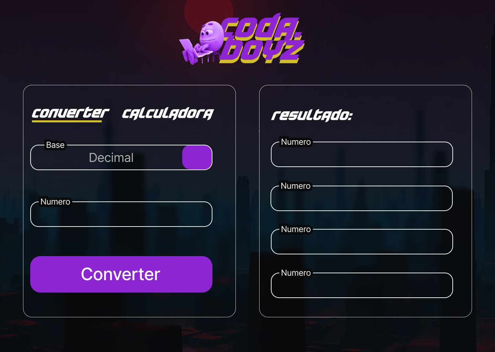
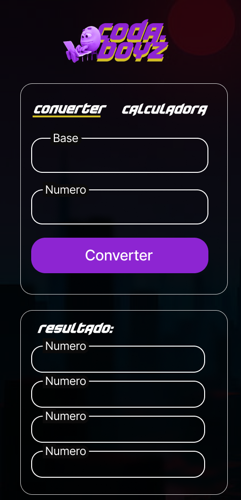
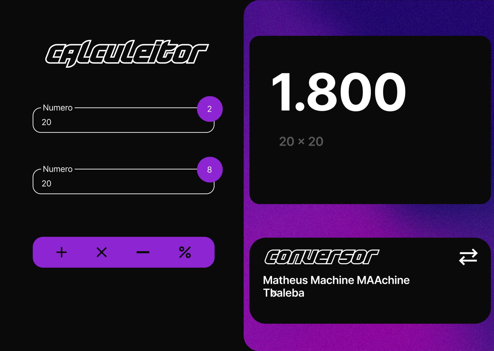

# Calculadora Binária

Uma calculadora simples desenvolvida com **HTML, CSS e JavaScript** para converter números entre os sistemas **binário e decimal**.

## 🌟 Funcionalidades

- Converter números **decimais para binários**.
- Converter números **binários para decimais**.
- Interface simples e responsiva.

## 📝 Tecnologias Utilizadas

- **HTML** - Estrutura do site.
- **CSS** - Estilização da interface.
- **JavaScript** - Lógica de conversão entre os sistemas numéricos.

## 🔄 Como Usar

1. Clone este repositório:
   ```bash
   git clone https://github.com/HygorSW/CodaBoyz-Machine
   ```
2. Abra o arquivo `.html` no seu navegador.
3. Insira um número binário, decimal ou outro e clique no botão correspondente para converter.

## 🌐 Demonstração
 





## ✨ Autor

Feito por [Hygor Silva e Erick Silva](https://github.com/HygorSW)(https://github.com/Erickify).

---

Se gostou do projeto, não esqueça de deixar uma ⭐ no repositório!

